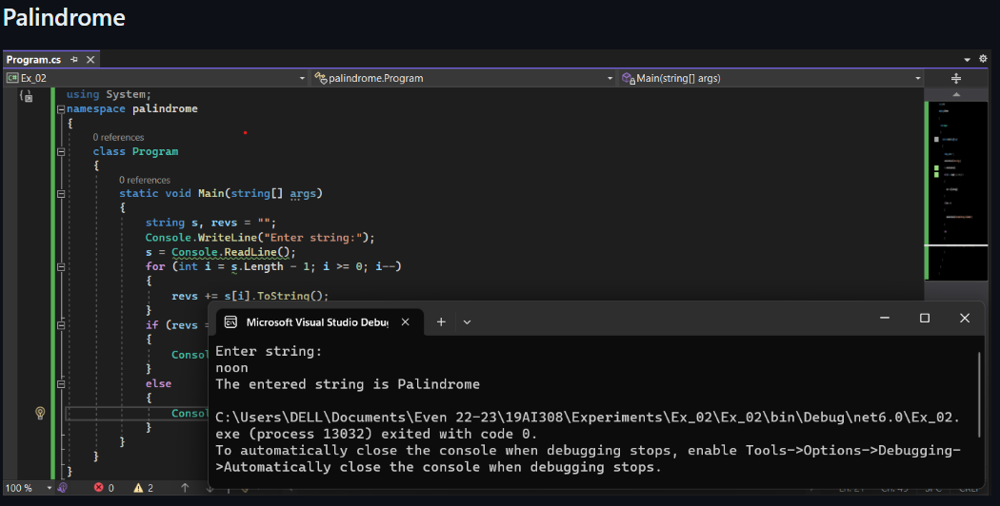
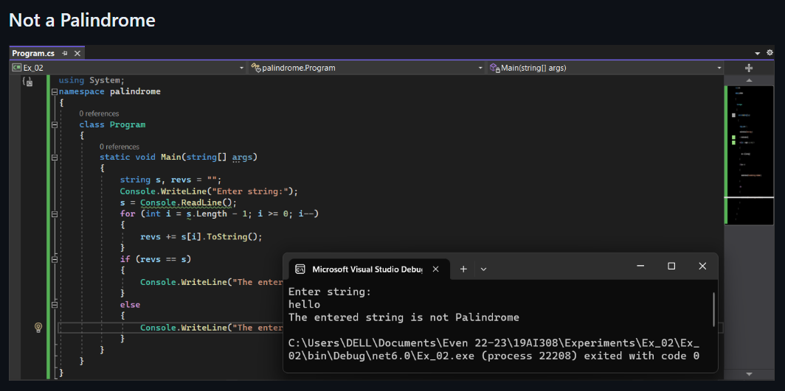

# Palindrome

## Aim:
To write a C# program to find whether the given string is a Palindrome or not.
## Algorithm:
Step 1 :
Start the execution.

Step 2 :
Declare a string variable and get the input from the user.

Step 3 :
Initiate a for loop using the length of the string and reverse it.

Step 4 :
Using if condition, check whether the entered string is palindrome or not.

Step 5 :
Print the statement.

Step 6 :
Stop the execution.
## Program:
~~~
using System;
namespace palindrome
{
    class Program
    {
        static void Main(string[] args)
        {
            string s, revs = "";
            Console.WriteLine("Enter string:");
            s = Console.ReadLine();
            for (int i = s.Length - 1; i >= 0; i--)
            {
                revs += s[i].ToString();
            }
            if (revs == s)
            {
                Console.WriteLine("The entered string is Palindrome");
            }
            else
            {
                Console.WriteLine("The entered string is not Palindrome");
            }
        }
    }
}
~~~
## Output:

## Result:
Thus the C# program to display whether the given string is Palindrome or not is executed successfully.
